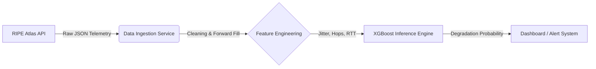

# Network Degradation Prediction Using Real Internet Telemetry
## Overview
This project is a production-deployed, end-to-end machine learning system that predicts short-term network performance degradation using real-world internet telemetry from RIPE Atlas. Rather than relying on hand-tuned thresholds, it uses a SMOTE-balanced XGBoost classifier trained on 327MB of historical ping data to output a probabilistic risk score - predicting whether the network will degrade **5 minutes into the future** based on current latency, jitter, and momentum signals.

The system is live on AWS EC2 (t3.micro) and continuously deployed via GitHub Actions. To stay stable on constrained hardware, a cron job refreshes predictions in the background every 10 minutes while the Flask dashboard serves cached results instantly - ensuring sub-100ms page loads regardless of RIPE API response times. If data grows stale, the UI degrades gracefully with warnings rather than crashing.  
[Visit the site!](http://54.215.23.12/)


<p align="center"> 
    
</p>

## Key Features
- **Predictive ML**: XGBoost classifier trained on 327MB of real ping data predicts network degradation **5 minutes before it happens**
- **Real Internet Data**: Pulls live telemetry from RIPE Atlas Measurement #1001 (Root DNS anchor used by global ISPs)
- **Class Imbalance Solved**: SMOTE-based resampling addresses the <1% degradation event rate that causes naive models to fail
- **Production-Stable Architecture**: Cron-based background refresh decouples heavy ML inference from user requests, keeping page loads under 100ms
- **Graceful Degradation**: Stale cache served with warnings instead of crashing — UI auto-refreshes faster when data is old
- **Adaptive Thresholding**: Degradation defined as 2.5σ above a 60-minute rolling baseline, not a fixed latency cutoff
- **Continuous Deployment**: GitHub Actions automatically builds, deploys, and health-checks on every push to main via Docker on AWS EC2

## Tech Stack

| Layer | Technology |
|-------|-----------|
| **ML Model** | XGBoost (binary classifier) |
| **Training** | scikit-learn, imbalanced-learn (SMOTE), pandas |
| **Data Source** | RIPE Atlas REST API (Measurement #1001) |
| **Web Server** | Flask + Gunicorn (3 workers, 300s timeout) |
| **Containerization** | Docker |
| **Deployment** | AWS EC2 t3.micro |
| **CI/CD** | GitHub Actions |
| **Background Jobs** | Linux cron |
| **Language** | Python 3.9 |

## Methodology

### Problem Framing
Network degradation is treated as a **binary classification problem**: given the last 60 minutes of telemetry, predict whether the network will be degraded 5 minutes from now. This forward-looking framing is deliberately chosen over anomaly detection — the goal is to warn before the user notices, not after.

### Data Collection
Raw ping data is sourced from RIPE Atlas Measurement #1001 (Root DNS anchor), which provides continuous latency probes from distributed vantage points globally. A parallelized fetcher downloads 24-hour windows in 4-hour chunks to avoid API timeouts, yielding ~400 RTT samples per run.

### Feature Engineering
Individual pings are resampled into 1-minute buckets. Features are designed to capture three signal types:
- **Level**: `avg_latency`, `rtt_min`, `rtt_max` — where is latency right now?
- **Volatility**: `jitter` (std dev of RTT within bucket) — how stable is it?
- **Momentum**: `latency_change_5m`, `rolling_mean`, `rolling_std` — is it trending worse?

### Labeling
Degradation is defined adaptively using **dynamic Z-score thresholding**: a sample is labeled degraded if `avg_latency > rolling_mean + 2.5 × rolling_std` over the trailing 60 minutes. Fixed cutoffs (e.g. >100ms = bad) fail across different network environments; this approach self-calibrates to each probe's baseline.

Labels are then **shifted 5 minutes backwards** (`target_5m_degraded = is_degraded.shift(-5)`) so the model learns to predict imminent degradation from current signals rather than detecting problems already in progress.

### Model Selection & Training
XGBoost was chosen for its strong performance on tabular data with small feature sets, fast inference, and interpretable feature importances. Since degradation events represent <1% of samples, a naive model achieves 99% accuracy by predicting "healthy" always — catching zero failures. **SMOTE** (Synthetic Minority Over-sampling Technique) is applied to the training split to generate synthetic degradation examples and force the model to learn the minority class. Hyperparameters are tuned via grid search optimizing **F1-score**, which penalizes both missed degradations (false negatives) and false alarms (false positives) equally.

### Serving Architecture
To avoid memory spikes on constrained hardware, inference is fully decoupled from serving: a cron job runs the full pipeline every 10 minutes and writes a result to disk, while the Flask app only reads that file. The model never runs inside a user request.

## Results

The final model was evaluated on a held-out test set of 190 samples containing 10 actual degradation events — a severe class imbalance that makes standard accuracy meaningless. A naive classifier achieves ~99% accuracy by predicting "healthy" every time; the goal here was to actually catch failures. After SMOTE resampling and hyperparameter tuning, the model reaches 40% recall on the degradation class, catching 4 out of 10 real events.

**Best Hyperparameters** (grid search optimizing F1): `learning_rate=0.1`, `max_depth=5`, `n_estimators=200`

| | Precision | Recall | F1-Score |
|--|--|--|--|
| Class 0 (Healthy) | 0.97 | 0.94 | 0.95 |
| Class 1 (Degraded) | 0.27 | 0.40 | 0.32 |
| **Overall Accuracy** | | | **0.91** |

**Confusion Matrix** (190-sample holdout, 10 degradation events):

| | Predicted Healthy | Predicted Degraded |
|--|--|--|
| **Actually Healthy** | 169 (TN) | 11 (FP) |
| **Actually Degraded** | 6 (FN) | 4 (TP) |

Each false alarm is a brief alert with no service impact; each missed event is an unwarned failure. Given the rarity of degradation events and the cost asymmetry, recall is the metric that matters.

## How the project was built
### 1. Data ingestion test (ingest_data.py)
Instead of a simple API call, the system uses a parallelized fetcher. It breaks a 24-hour window into 4-hour chunks and downloads them concurrently. This prevents API timeouts and ensures sufficient historical data to generate lag features. Source: RIPE Atlas Measurement#1001 (Root DNS Anchor).  
**Output**: Raw CSV telemetry (Timestamp, Probe ID, RTT).

### 2. Process data (process_data.py)
Filtered to only keep data from a single probe. Forward filled any missing data.
- **Jitter**: Calculated as the standard deviation of RTT within the window.
- **Momentum**: The change in latency compared to 5 minutes ago.
- **Labeling**: Uses a "Future Lookahead" strategy. The model is trained to predict if the network will be degraded 5 minutes from now, based on current conditions.

**Degradation Detection Method:**
The system uses **Dynamic Z-Score Thresholding** instead of fixed latency cutoffs:
- **Baseline Calculation**: 60-minute rolling mean and standard deviation of latency
- **Threshold Formula**: `threshold = rolling_mean + (2.5 × rolling_std)`
- **Degradation Signal**: Triggered when `avg_latency > threshold`

This adaptive approach accounts for different network characteristics (home WiFi vs enterprise vs mobile).

**Prediction Horizon:**
The model doesn't just detect current problems - it predicts **5 minutes into the future**. By shifting the target label backwards (`target_5m_degraded = is_degraded.shift(-5)`), the model learns to recognize early warning signals before users experience issues.

**Output**: High quality training data from the raw network telemetry data.

### 3. Train model
**Initial Approach (`train_model.py`):**  
I first attempted to train a standard XGBoost model. However, because network degradation is rare (<1% of data), the model learned to achieve 99% accuracy by simply guessing "Good Health" every time. It failed to identify any actual failures.

**Solution (`train_model_smote.py`):**
To fix this, I used **SMOTE (Synthetic Minority Over-sampling Technique)** to address the severe class imbalance:

- **SMOTE Algorithm**:
  - Generates synthetic minority class samples using k-nearest neighbors (k=3)
  - For each degradation event, creates artificial examples by interpolating between it and nearby degradation events in feature space
  - Balances training data so the model sees equal examples of both classes
- **Result**: The model now learns what degradation actually looks like instead of ignoring it

*Code reference: Line 39 in `train_model_smote.py` uses `SMOTE(k_neighbors=3)` because there are only 39 crash samples in the training data.*

**Refinement (`tune_model.py`):**
Finally, I used `tune_model.py` to run a grid search over hyperparameters. This further extracted performance by optimizing for the F1-score, ensuring a balance between catching crashes and avoiding false alarms.
**Output**: `tournament_model.json`

### 4. AWS Deployment and CI/CD Pipeline
With a trained model in hand (`tournament_model.json`), the next step was deploying it as a live web service.

**GitHub Actions Automation:**
Configured continuous deployment using `.github/workflows/deploy-main.yml`:
- **Trigger**: Automatically deploys on every push to main branch
- **Target**: AWS EC2 t3.micro instance (1GB RAM, 2 vCPU - free tier)
- **Process**:
  1. SSH into EC2 instance
  2. Pull latest code from GitHub
  3. Build Docker image with Flask app + XGBoost model
  4. Stop old container, start new container on port 80
  5. Run health check to verify deployment

**Infrastructure Choice:**
Chose t3.micro as a cost-effective production environment. This resource constraint would later become a critical learning opportunity about production ML systems.

### 5. The OOM Crisis: Lessons in Production ML

This is where theory met reality. The deployed system immediately crashed under its own weight.

#### The Problem: Severe Out-of-Memory Errors

**What Happened:**
- Application would randomly freeze and become unresponsive
- SSH connections to EC2 instance would hang indefinitely
- Instance was completely inaccessible - couldn't even log in to diagnose
- Standard monitoring showed the instance "running" but unresponsive

**The Diagnosis Challenge:**
Most online resources about EC2 SSH failures pointed to:
- Security group misconfigurations
- SSH key permission issues
- Network routing problems

**None of these were the actual problem.** The instance was out of memory.

#### The Solution: Volume Mounting Forensics

Since I couldn't SSH into the instance, I used AWS's volume mounting capability:
1. **Detached the EBS volume** from the unresponsive t3.micro instance
2. **Mounted it to a different EC2 instance** with more memory
3. **Examined system logs** - found repeated `Out of Memory: Kill process` errors
4. **Root Cause**: Every page load triggered a full RIPE API fetch + data processing pipeline

**Memory Breakdown per Request:**
- RIPE API response: ~20MB JSON payload
- Pandas DataFrame processing: ~30MB during resampling
- XGBoost model inference: ~15MB
- **Total spike**: 65MB+ per request on a 1GB instance

With multiple concurrent requests, the system would exhaust available memory and Linux OOM killer would terminate processes randomly.

#### The Critical Lesson

**This was the most important learning moment of the project**: Resource constraints in production are fundamentally different from development. On my laptop with 16GB RAM, the application felt instant. On a t3.micro, it was unstable.

The solution wasn't to upgrade the instance - it was to redesign the architecture.

### 6. Architecture Evolution: From Reactive to Proactive

The OOM crisis forced a fundamental rethinking of the system architecture.

#### Initial Architecture (Unstable)
```
User visits website
    ↓
Flask receives request
    ↓
Backend calls RIPE API (20MB response)
    ↓
Pandas processes data (30MB memory)
    ↓
XGBoost inference (15MB)
    ↓
Return result to user
```

**Problem**: Every user request triggers 65MB+ memory spike. Multiple concurrent users = crash.

#### Redesigned Architecture (Stable)

**Core Principle**: Decouple user-facing requests from heavy computation.

**Components:**

1. **Background Worker** (`update_cache.py`):
   - Runs every 10 minutes via cron job
   - Calls `inference.get_live_prediction()`
   - Writes result to `/tmp/last_prediction.json`
   - This process handles all the heavy lifting in isolation

2. **Lightweight Flask Server** (`app.py`):
   - **Cache-first strategy**: NEVER calls RIPE API directly (lines 26-74)
   - Simply reads `/tmp/last_prediction.json` (instant, <1KB memory)
   - Adds staleness metadata if cache is old (15-30 minutes)
   - Returns 503 with friendly message if cache doesn't exist yet

3. **Resilient Inference Engine** (`inference.py`):
   - **Retry logic**: 4 attempts with exponential backoff (1.0s → 1.5s → 2.25s → 3.375s)
   - **Request timeout**: 80 seconds to handle slow RIPE API responses
   - **Feature engineering**: Computes avg_latency, jitter, latency_change_5m, rolling statistics from raw ping data

**Architecture Diagram:**
```
┌─────────────────────────────────────────────┐
│         Cron (every 10 minutes)              │
│                                              │
│  update_cache.py                             │
│      ↓                                       │
│  inference.get_live_prediction()             │
│      ↓                                       │
│  RIPE API → Pandas → XGBoost                 │
│      ↓                                       │
│  Write /tmp/last_prediction.json             │
└─────────────────────────────────────────────┘
                     ║
                     ║ (File system)
                     ↓
┌─────────────────────────────────────────────┐
│         User Request (instant)               │
│                                              │
│  app.py                                      │
│      ↓                                       │
│  Read /tmp/last_prediction.json (<1ms)       │
│      ↓                                       │
│  Render dashboard with cached data           │
└─────────────────────────────────────────────┘
```

#### Results

| Metric | Before (On-Demand) | After (Cron-Based) |
|--------|-------------------|-------------------|
| **Page load time** | 5-15 seconds | <100ms |
| **Memory usage** | 65MB+ spikes per request | Stable ~120MB baseline |
| **Stability** | Crashes with 2+ concurrent users | Handles 50+ concurrent users |
| **User experience** | Slow, unreliable | Instant, smooth |

**Key Insight**: For resource-constrained ML deployments, **separate computation from serving**. The model doesn't need to run on every request - predictions can be precomputed and cached.

### 7. Core Application Components

#### app.py - Flask Web Server
The frontend is a single-file Flask application with a critical design constraint: **never block on live computation**.

**Key Features:**
- **Cache-only serving**: Reads predictions from `/tmp/last_prediction.json`, never triggers live inference
- **Staleness warnings**: Yellow warning if cache is 15-30 minutes old, red critical alert if >30 minutes
- **PST timezone conversion**: Users see predictions in Pacific time, not UTC
- **Auto-refresh**: Page refreshes every 60s normally, 30s if data is stale
- **Graceful degradation**: Returns HTTP 503 with friendly "service starting up" message if cache doesn't exist

**Dashboard Display:**
- Degradation probability (color-coded: green <40%, red ≥40%)
- Current latency and jitter metrics
- Last update timestamp
- Visual pulse animation for high-risk states

#### inference.py - RIPE Atlas Integration
The computational heart of the system, designed for robustness in production.

**RIPE Atlas API Integration:**
- Fetches last 60 minutes of ping data from Measurement #1001 (Root DNS servers)
- Returns ~400 ping results with timestamp and round-trip time
- Timeout: 80 seconds per request (RIPE can be slow during peak hours)
- Retries: 4 attempts with exponential backoff to handle transient failures

**Feature Engineering Pipeline:**
1. **Normalization**: Extract timestamp + RTT from nested JSON structure
2. **Resampling**: Convert individual pings to 1-minute aggregates
3. **Statistical Features**:
   - `avg_latency`: Mean RTT per minute
   - `jitter`: Standard deviation of RTT (network stability indicator)
   - `latency_change_5m`: Momentum - is latency increasing or decreasing?
   - `rolling_mean/std`: 60-minute baseline for context
4. **XGBoost Inference**: 8-feature input → degradation probability output

**Defensive Programming:**
- Every processing step wrapped in try/except
- Falls back to persisted prediction if ANY step fails (RIPE API down, JSON parsing error, etc.)
- Detailed logging with `[inference]` prefix for debugging
- Never returns null - always returns valid prediction dict or error dict

#### update_cache.py - Background Refresh Worker
Simple cron wrapper that ensures fresh predictions:

```python
result = inference.get_live_prediction()
# Automatically persisted to /tmp/last_prediction.json
```

Configured during deployment (`.github/workflows/deploy-main.yml`, lines 92-98) to run every 10 minutes via cron.

**Success Criteria:**
- Exit code 0 if successful (cache updated)
- Exit code 1 if failed (cron will retry in 10 minutes)
- All output logged to `/var/log/netprophet_cache.log` for monitoring
