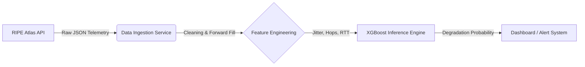

# Network Degradation Prediction Using Real Internet Telemetry

[]()
[](http://54.215.23.12/)
[]()
[]()
[]()

## Overview
This project is a production-deployed, end-to-end machine learning system that predicts short-term network performance degradation using real-world internet telemetry from RIPE Atlas. Rather than relying on hand-tuned thresholds, it uses a SMOTE-balanced XGBoost classifier trained on 327MB of historical ping data to output a probabilistic risk score - predicting whether the network will degrade **5 minutes into the future** based on current latency, jitter, and momentum signals.

The system is live on AWS EC2 (t3.micro) and continuously deployed via GitHub Actions. To stay stable on constrained hardware, a cron job refreshes predictions in the background every 10 minutes while the Flask dashboard serves cached results instantly - ensuring sub-100ms page loads regardless of RIPE API response times. If data grows stale, the UI degrades gracefully with warnings rather than crashing.  
[Visit the site!](http://54.215.23.12/)

#### High level pipeline:


#### Preview:
<p align="center"> 
    
</p>

## Key Features
- **Predictive ML**: XGBoost classifier trained on 327MB of real ping data predicts network degradation **5 minutes before it happens**
- **Real Internet Data**: Pulls live telemetry from RIPE Atlas Measurement #1001 (Root DNS anchor used by global ISPs)
- **Class Imbalance Solved**: SMOTE-based resampling addresses the <1% degradation event rate that causes naive models to fail
- **Production-Stable Architecture**: Cron-based background refresh decouples heavy ML inference from user requests, keeping page loads under 100ms
- **Graceful Degradation**: Stale cache served with warnings instead of crashing — UI auto-refreshes faster when data is old
- **Adaptive Thresholding**: Degradation defined as 2.5σ above a 60-minute rolling baseline, not a fixed latency cutoff
- **Continuous Deployment**: GitHub Actions automatically builds, deploys, and health-checks on every push to main via Docker on AWS EC2

## Tech Stack

| Layer | Technology |
|-------|-----------|
| **ML Model** | XGBoost (binary classifier) |
| **Training** | scikit-learn, imbalanced-learn (SMOTE), pandas |
| **Data Source** | RIPE Atlas REST API (Measurement #1001) |
| **Web Server** | Flask + Gunicorn (3 workers, 300s timeout) |
| **Containerization** | Docker |
| **Deployment** | AWS EC2 t3.micro |
| **CI/CD** | GitHub Actions |
| **Background Jobs** | Linux cron |
| **Language** | Python 3.9 |

## Methodology

### Problem Framing
Network degradation is treated as a **binary classification problem**: given the last 60 minutes of telemetry, predict whether the network will be degraded 5 minutes from now. This forward-looking framing is deliberately chosen over anomaly detection — the goal is to warn before the user notices, not after.

### Data Collection
Raw ping data is sourced from RIPE Atlas Measurement #1001 (Root DNS anchor), which provides continuous latency probes from distributed vantage points globally. A parallelized fetcher downloads 24-hour windows in 4-hour chunks to avoid API timeouts, yielding ~400 RTT samples per run.

### Feature Engineering
Individual pings are resampled into 1-minute buckets. Features are designed to capture three signal types:
- **Level**: `avg_latency`, `rtt_min`, `rtt_max` — where is latency right now?
- **Volatility**: `jitter` (std dev of RTT within bucket) — how stable is it?
- **Momentum**: `latency_change_5m`, `rolling_mean`, `rolling_std` — is it trending worse?

### Labeling
Degradation is defined adaptively using **dynamic Z-score thresholding**: a sample is labeled degraded if `avg_latency > rolling_mean + 2.5 × rolling_std` over the trailing 60 minutes. Fixed cutoffs (e.g. >100ms = bad) fail across different network environments; this approach self-calibrates to each probe's baseline.

Labels are then **shifted 5 minutes backwards** (`target_5m_degraded = is_degraded.shift(-5)`) so the model learns to predict imminent degradation from current signals rather than detecting problems already in progress.

### Model Selection & Training
XGBoost was chosen for its strong performance on tabular data with small feature sets, fast inference, and interpretable feature importances. Since degradation events represent <1% of samples, a naive model achieves 99% accuracy by predicting "healthy" always — catching zero failures. **SMOTE** (Synthetic Minority Over-sampling Technique) is applied to the training split to generate synthetic degradation examples and force the model to learn the minority class. Hyperparameters are tuned via grid search optimizing **F1-score**, which penalizes both missed degradations (false negatives) and false alarms (false positives) equally.

### Serving Architecture
To avoid memory spikes on constrained hardware, inference is fully decoupled from serving: a cron job runs the full pipeline every 10 minutes and writes a result to disk, while the Flask app only reads that file. The model never runs inside a user request.

**Architecture Diagram:**
```
┌─────────────────────────────────────────────┐
│         Cron (every 10 minutes)              │
│                                              │
│  update_cache.py                             │
│      ↓                                       │
│  inference.get_live_prediction()             │
│      ↓                                       │
│  RIPE API → Pandas → XGBoost                 │
│      ↓                                       │
│  Write /tmp/last_prediction.json             │
└─────────────────────────────────────────────┘
                     ║
                     ║ (File system)
                     ↓
┌─────────────────────────────────────────────┐
│         User Request (instant)               │
│                                              │
│  app.py                                      │
│      ↓                                       │
│  Read /tmp/last_prediction.json (<1ms)       │
│      ↓                                       │
│  Render dashboard with cached data           │
└─────────────────────────────────────────────┘
```

## Results

The final model was evaluated on a held-out test set of 190 samples containing 10 actual degradation events — a severe class imbalance that makes standard accuracy meaningless. A naive classifier achieves ~99% accuracy by predicting "healthy" every time; the goal here was to actually catch failures. After SMOTE resampling and hyperparameter tuning, the model reaches 40% recall on the degradation class, catching 4 out of 10 real events.

**Best Hyperparameters** (grid search optimizing F1): `learning_rate=0.1`, `max_depth=5`, `n_estimators=200`

| | Precision | Recall | F1-Score |
|--|--|--|--|
| Class 0 (Healthy) | 0.97 | 0.94 | 0.95 |
| Class 1 (Degraded) | 0.27 | 0.40 | 0.32 |
| **Overall Accuracy** | | | **0.91** |

**Confusion Matrix** (190-sample holdout, 10 degradation events):

| | Predicted Healthy | Predicted Degraded |
|--|--|--|
| **Actually Healthy** | 169 (TN) | 11 (FP) |
| **Actually Degraded** | 6 (FN) | 4 (TP) |

Each false alarm is a brief alert with no service impact; each missed event is an unwarned failure. Given the rarity of degradation events and the cost asymmetry, recall is the metric that matters.
