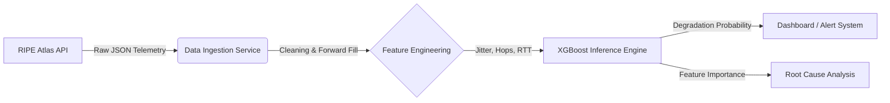

# Network Degradation Prediction Using Real Internet Telemetry
## Overview
This project builds an end-to-end machine learning system to predict short-term network performance degradation using real-world internet measurement data from RIPE Atlas.

The goal is to identify early warning signals before users experience severe latency or packet loss by learning patterns in recent network behavior. Rather than relying on hand-tuned thresholds, the system uses supervised machine learning to output a probabilistic risk score indicating the likelihood of near-future degradation.

## Key Features

## Tech Stack

## Methodology

## Results