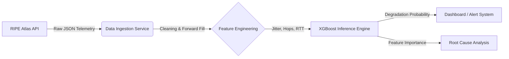

# Network Degradation Prediction Using Real Internet Telemetry
## Overview
This project builds an end-to-end machine learning system to predict short-term network performance degradation using real-world internet measurement data from RIPE Atlas.

The goal is to identify early warning signals before users experience severe latency or packet loss by learning patterns in recent network behavior. Rather than relying on hand-tuned thresholds, the system uses supervised machine learning to output a probabilistic risk score indicating the likelihood of near-future degradation.

## Key Features

## Tech Stack

## Methodology

## Results

## How the project was built
### 1. Data ingestion test (ingest_data.py)
Instead of a simple API call, the system uses a parallelized fetcher. It breaks a 24-hour window into 4-hour chunks and downloads them concurrently. This prevents API timeouts and ensures sufficient historical data to generate lag features. Source: RIPE Atlas Measurement#1001 (Root DNS Anchor).  
Output: Raw CSV telemetry (Timestamp, Probe ID, RTT).(network_telemetry.csv).

### 2. Process data (process_data.py)
Filtered for to only keep data from a single probe. Forward filled any missing data.  
Jitter: Calculated as the standard deviation of RTT within the window.  
Momentum: The change in latency compared to 5 minutes ago.  
Labeling: Uses a "Future Lookahead" strategy. The model is trained to predict if the network will be degraded 5 minutes from now, based on current conditions.  
Output: High quality training data from the raw network telemetry data(training_data.csv).

### 3. Train model
**Initial Approach (`train_model.py`):**  
I first attempted to train a standard XGBoost model. However, because network degradation is rare (<1% of data), the model learned to achieve 99% accuracy by simply guessing "Good Health" every time. It failed to identify any actual failures.

**Solution (`train_model_smote.py`):**  
To fix this, I used **SMOTE** to generate synthetic examples of network crashes. This balanced the training data and allowed the model to learn the patterns of degradation.

**Refinement (`tune_model.py`):**  
Finally, I used `tune_model.py` to run a grid search over hyperparameters. This further extracted performance by optimizing for the F1-score, ensuring a balance between catching crashes and avoiding false alarms.  
Output: `tournament_model.json`